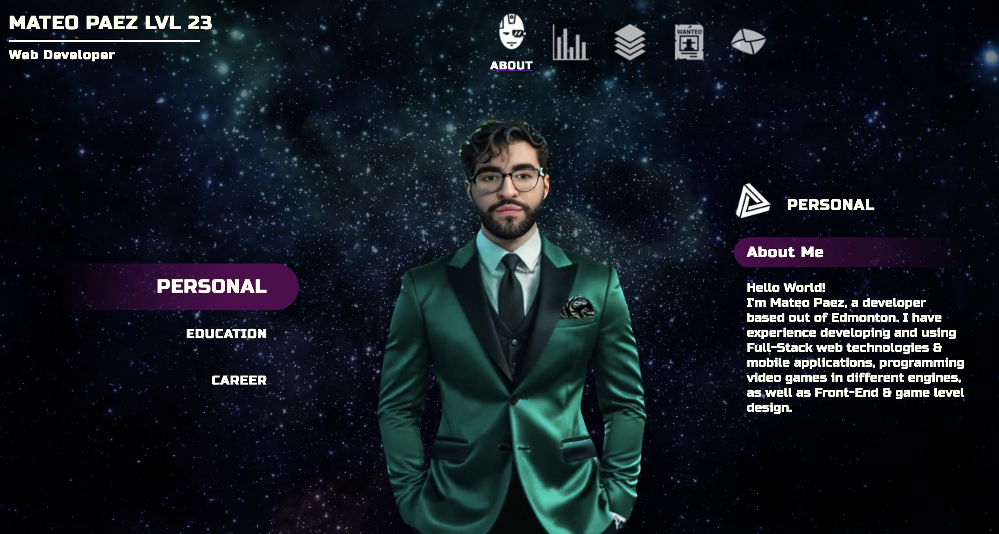

# Mateo's OLD Website

This is the *original* personal portfolio website that I made in React. Visit at at [mateopaez.github.io](https://mateopaez.github.io/).

# Website Theme & Ideas

My website is designed with a unique video game avatar screen theme, featuring an immersive floating HUD.
The 'About' page introduces my personal avatar and key information.
On the 'Skills' page, I showcase my technical profiencies using dynamic skill bars.
The 'Projects' page highlights my development work, while the 'Resume' page offers an interactive way to view and download my resume.
Finally, the 'Contact' page makes it easy for visitors to connect with me directly.
I also used responsive web design for mobile screens!

# Getting Started with Create React App

This project was bootstrapped with [Create React App](https://github.com/facebook/create-react-app).

## Learn More

You can learn more in the [Create React App documentation](https://facebook.github.io/create-react-app/docs/getting-started).

To learn React, check out the [React documentation](https://reactjs.org/).
